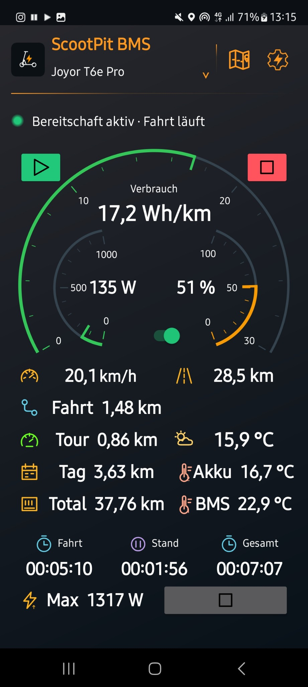
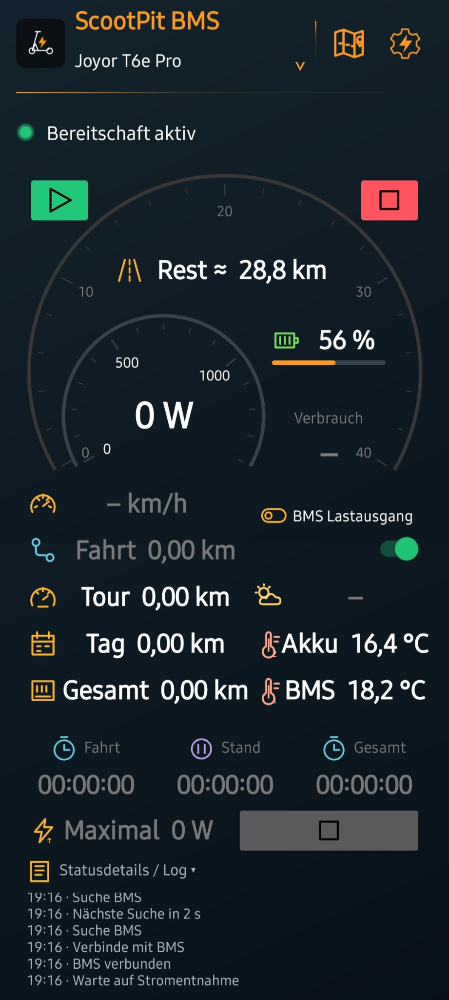
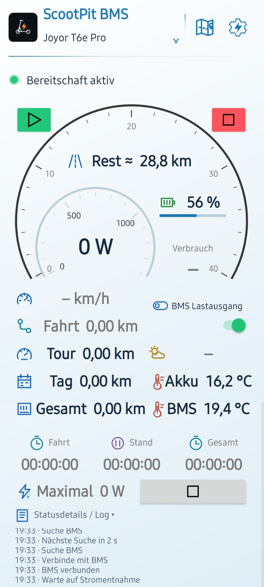
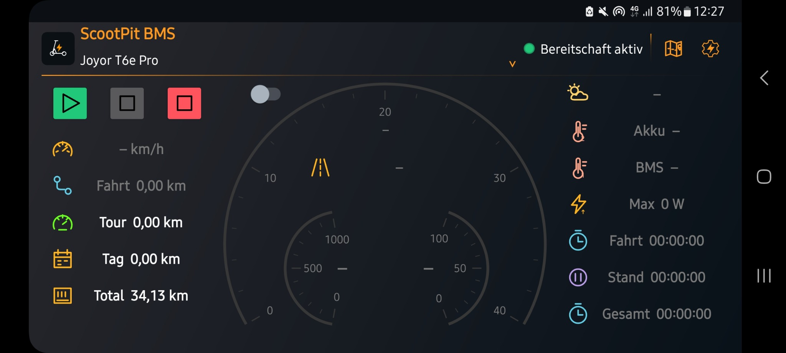
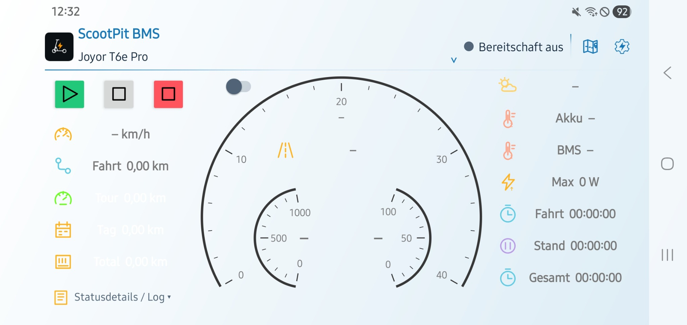
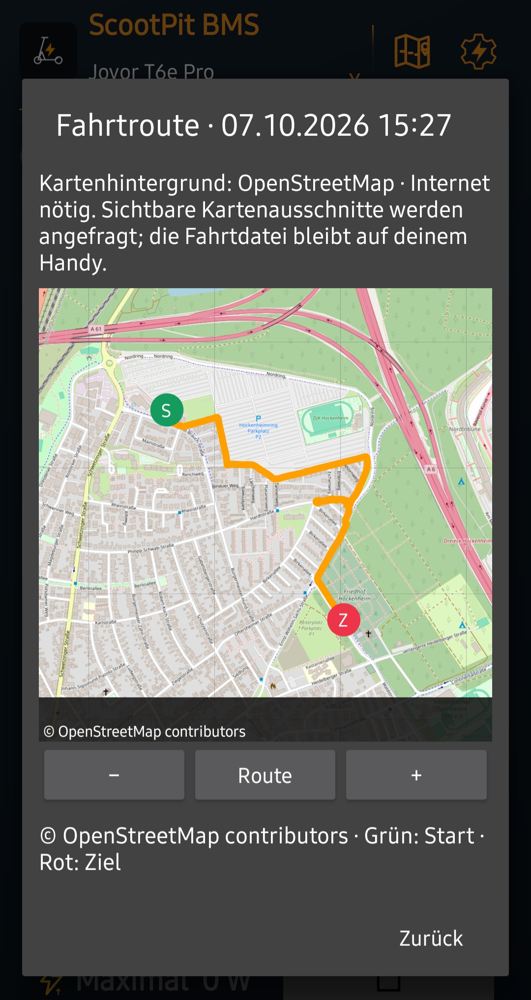
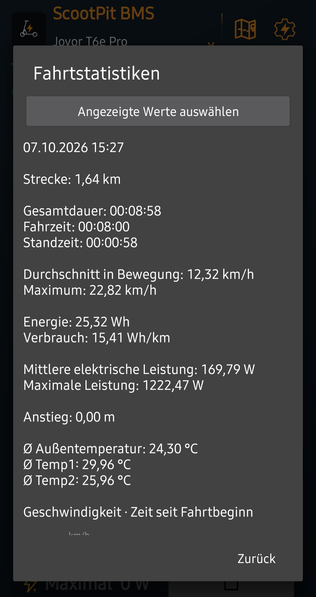
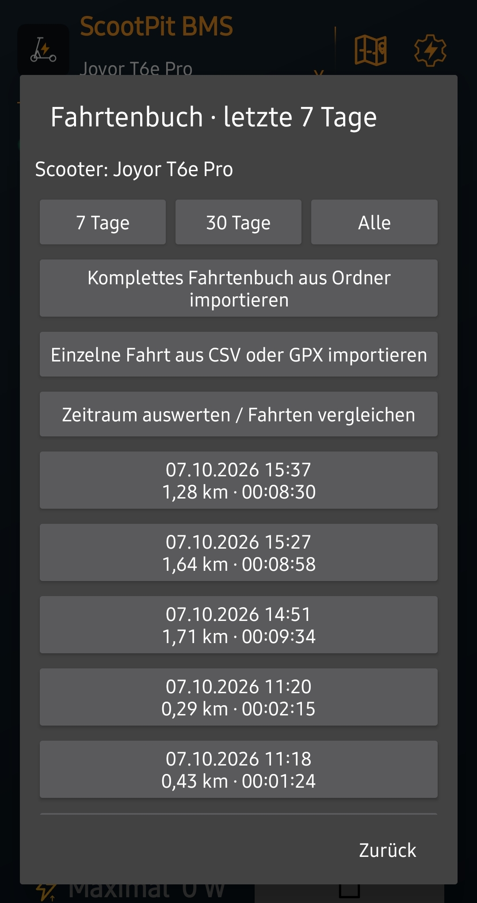

# ScootPit BMS

**Automatisches Fahrtenbuch für deinen E-Scooter – auch mit dem Handy in der Hosentasche.**

**ScootPit – für alle, die ihren Roller überwachen wollen, ohne selbst überwacht zu werden.**

**Version 1.5.7 · [APK herunterladen](https://github.com/Tim-Gurke/ScootPit-BMS-Public/releases/latest)**

Das Highlight ist die Automatik: **Bereitschaft einschalten, zum Scooter gehen und losfahren.** ScootPit erkennt ein gespeichertes Bluetooth-BMS in Reichweite, wählt das zugehörige Scooter-Profil und verbindet sich bei ausreichend stabilem Empfang automatisch. Die Fahrtaufzeichnung startet, sobald die eingestellten Bedingungen für die Stromentnahme erfüllt sind. Die Annäherung allein startet noch keine Fahrt.

Die Aufzeichnung läuft auch mit ausgeschaltetem Bildschirm und gesperrtem Handy. Beim Ausrollen wird GPS weiter ausgewertet. Nach **45 Sekunden zuverlässig erkanntem Stillstand** oder **15 Sekunden langsamer Bewegung ohne Motorlast** pausiert die Fahrt; Fußwege werden nicht als Fahrstrecke gezählt. Die BMS-Verbindung bleibt bestehen. Eine Fortsetzung erfordert passende GPS-Fahrgeschwindigkeit und anhaltende Motorlast. Nach **10 Minuten Pause** wird sie rückwirkend zum Pausenbeginn abgeschlossen. Geht die Verbindung während der Pause verloren, sucht die App weiter und wartet standardmäßig bis 2 Minuten nach Pausenbeginn auf eine Wiederverbindung. Die Zeiten sind je Scooter einstellbar. GPS-Ausfall allein gilt nicht als Stillstand.

Mehrere gespeicherte Scooter? Die App prüft erreichbare BMS nacheinander und übernimmt das passende Profil. Während einer laufenden Fahrt bleibt die Zuordnung fest. Unbekannte BMS werden nicht ungefragt übernommen; jedes Gerät wird bei der Einrichtung einmal seinem Profil zugeordnet.

Am Lenker wird ScootPit zum **persönlichen Energie-Cockpit**: Der Verbrauch einer frei wählbaren Strecke und die aktuelle elektrische Leistung stehen im Mittelpunkt. Akku, Restreichweite, Kilometer und Temperaturen ergänzen die Übersicht; GPS-Geschwindigkeit bleibt als kleinere Anzeige verfügbar.

### Hauptansicht · Fahrt läuft

<em>Aktuelle Hauptansicht während der Fahrt · Samsung Galaxy S20 FE 5G · Android 13.</em>

### Weitere Ansichten

<em>Dunkles Cockpit im Hochformat · Samsung Galaxy S20 FE 5G · Android 13.</em>

<em>Helles Design im Hochformat · Samsung Galaxy S10 · ArtisanROM Quant 3.1.1 (Android 16).</em>

### Querformat

<em>Dunkles Design im Querformat · Samsung Galaxy S20 FE 5G · Android 13.</em>

<em>Helles Design im Querformat · Samsung Galaxy S10 · ArtisanROM Quant 3.1.1 (Android 16).</em>

## Was bringt dir ScootPit?

- **Automatisches Tracking:** Fahrtstart und Fahrtende erkennen, Fahr- und Standzeit erfassen, auch mit gesperrtem Handy.
- **Live-Werte im Blick:** GPS-Tacho, Akkustand, Spannung, Strom, Leistung, Energie, Temperaturen und verfügbare Zusatzdaten des BMS.
- **Drei Kilometerzähler:** Gesamtkilometer, Tageskilometer mit täglichem Neustart und ein manuell zurücksetzbarer Tourenzähler – getrennt je Scooter.
- **Fahrtenbuch mit Karte:** Fahrten der letzten 7 oder 30 Tage oder das ganze Fahrtenbuch ansehen, Route mit Start und Ziel anzeigen, zoomen, verschieben, GPX/CSV teilen und einzelne Fahrten oder den kompletten Bestand aus einem Ordner importieren.
- **Auswählbare Statistiken:** Per Häkchen Werte und Diagramme wählen. Geschwindigkeit, Leistung und GPS-Höhe im Zeitverlauf; Zeitraumübersicht, Tagesstrecken und Vergleich einzelner Fahrten.
- **Eigenes Cockpit:** Feines Raster mit 24 Spalten, überlappende Kacheln mit wählbarer Ebene, transparente Hintergründe, einzeln einstellbare Rahmen und Ecken. Zahl/Balken/Rundinstrument wählen, Kreisbogen und Drehwinkel stufenlos anpassen, Messwerte bleiben waagerecht. Skalen und Balken können je Kachel einen frei gefärbten Zwei- oder Dreifarbenverlauf erhalten; die Skalenrichtung lässt sich umkehren. Neue Installationen starten mit dem gespeicherten ScootPit-Design. Farben, Schrift und Einheitenposition lassen sich anpassen. Eigene Bild- und Freitextkacheln sowie getrennte Hoch-/Querformatlayouts.
- **Restreichweite einschätzen:** Akkureserve und Verbrauch berücksichtigen; aktuelle Fahrtdaten und passende Verbrauchshistorie verbessern die Schätzung. Startwert: 20 Wh/km.
- **Samsung-Routinen nutzen:** Editierbare Fahrtstart-/Fahrtende-Nachrichten können eingerichtete Routinen zum Umschalten des Energiesparmodus auslösen. Die App richtet die Routinen nicht selbst ein.
- **Daten behalten:** Fahrten und Einstellungen lokal speichern, zusätzliche Sicherungsordner auswählen. Keine Anmeldung erforderlich.

## Fahrtenbuch in Bildern

<em>Die Karte zeigt die aufgezeichnete Route mit grünem Start und rotem Ziel. Sichtbare OpenStreetMap-Kartenausschnitte werden bei Bedarf online geladen.</em>

<em>Die Einzelstatistik fasst Strecke, Fahr- und Standzeit, Energieverbrauch, Leistung sowie Temperaturwerte zusammen.</em>

<em>Im Fahrtenbuch kannst du einen Zeitraum wählen und den gesamten Scooter-Fahrtenordner oder einzelne CSV-/GPX-Fahrten importieren.</em>

## Neu in 1.5.6

Langsame GPS-Bewegung ohne BMS-Motorlast wird als möglicher Fußweg behandelt und nicht zur Fahrstrecke addiert. Nach der einstellbaren Verzögerung pausiert die Fahrt. Fortsetzen setzt zuverlässige GPS-Fahrgeschwindigkeit und anhaltende Motorlast voraus. Beim ersten Öffnen des Querformats werden Skalenbereiche, Farben, Farbübergänge und Skalenrichtung aus dem Hochformat übernommen; Kachelanordnung und -positionen bleiben erhalten.

## Neu in 1.5.7

Die Kartenansicht einer Fahrt erhält jetzt eine feste, an die Bildschirmhöhe angepasste Größe. Dadurch werden die Route und die OpenStreetMap-Kacheln im Fahrtenbuchdialog zuverlässig angezeigt.

## Neu in 1.5.5

Die Standardanordnungen für Hoch- und Querformat entsprechen jetzt deiner Einstellungsdatei. Die gespeicherten Farben, Skalen und Kachelpositionen wurden übernommen. Untermenüs wie **Speicherorte** lassen sich auch im Querformat bis zum Ende scrollen.

## Neu in 1.5.4

Das Querformat verwendet wieder das ursprüngliche 20-dp-Raster. Der flachere Appkopf und die Bereitschaftsanzeige im Kopf bleiben im Querformat erhalten.

## Neu in 1.5.2

In 1.5.2 wurde die Standardanordnung für Hoch- und Querformat neu festgelegt. Das Querformat nutzt 17 Rasterzeilen mit 20-dp-Höheneinheiten. Persönliche Layouts bleiben erhalten, bis du **Standardlayout** auswählst.

## Neu in 1.5.1

Die Richtung von Balken und Rundinstrumenten lässt sich pro Kachel umkehren. Hohe Werte liegen dann am Skalenanfang, Skalenmarkierungen und farbiger Bereich laufen entsprechend rückwärts. Messwert und Zahl bleiben unverändert.

## Neu in 1.5.0

Skalen von Balken und Rundinstrumenten lassen sich pro Kachel einfarbig, zweifarbig oder dreifarbig gestalten. Anfangsfarbe und Endfarbe sind frei wählbar; im Dreifarbenmodus kommt eine frei wählbare Mittelfarbe hinzu. Schieberegler legen fest, bis zu welchem Prozentwert die Anfangsfarbe und ab welchem Wert die Endfarbe voll angezeigt wird. Dazwischen verläuft der Übergang stufenlos. Der Verbrauch der letzten Strecke lässt sich für jeden Scooter zwischen 100 und 1000 m einstellen.

## Neu in 1.4.3

Das vollständige ScootPit-Fahrtenbuch lässt sich aus einem ausgewählten Ordner importieren. Fahrt-Metadaten und CSV-/GPX-Dateien werden dem aktiven Scooter zugeordnet; vorhandene Fahrten bleiben erhalten und Duplikate werden übersprungen. Die neue Ansicht **Alle** zeigt den gesamten importierten Zeitraum.

## Neu in 1.4.2

Der Knopf **Standardlayout** stellt jetzt das vollständige überlappende ScootPit-Layout aus der Voreinstellung wieder her. Das gilt getrennt für Hoch- und Querformat.

## Neu in 1.4.1

Fahrten lassen sich als CSV oder GPX in das Fahrtenbuch des aktiven Scooter-Profils importieren. Rundinstrumente können unabhängig von ihrer Bogenöffnung stufenlos gedreht werden; Zahlen und Einheiten bleiben waagerecht. Bei einer Neuinstallation ist das dunkle Cockpit mit orangefarbenen Akzenten und dem in den Einstellungen hinterlegten Layout voreingestellt. Bereits eingerichtete Profile behalten ihre eigene Gestaltung.

## Neu in 1.3.2

Die Rundinstrumente zeigen die Skalenwerte in runden Schritten. Der Messwert lässt sich je Instrument ausblenden oder mittig, höher bzw. tiefer platzieren. Bewusst überlappende Kacheln behalten beim Bearbeiten anderer Kacheln ihre Position. Die erste Wertezeile zeigt zwei flache, echte **Halbkreisinstrumente**: Verbrauch der letzten 500 m in Wh/km und aktuelle Leistung in W. Der Kreisausschnitt lässt sich je Instrument von **90° bis 270°** ändern, ebenso Skalenmaximum und Farben. Die 500-m-Anzeige erscheint, sobald genügend zusammenhängende Messdaten vorliegen.

Die Gestaltung wird leichter: **Dunkel/Orange** und **Hell/Blau**, frei wählbarer Bildschirm-Farbverlauf und ein Farbmischer mit Vorschau. Kachelrahmen, Rahmenfarbe, Eckenradius, Hintergrund und Innenabstand sind separat anpassbar. Überlappungen sind optional; du bestimmst, welche Kachel oben liegt. Das Raster ist in beiden Richtungen doppelt so fein. **Gesamtzeit** ergänzt Fahr- und Standzeit; Temperaturkacheln lassen sich antippen, um eine Aktualisierung anzufragen.

Der Appkopf mit Profil, Fahrtenbuch, Zahnrad mit Blitz und grünem Bereitschaftspunkt bleibt erhalten. Auch das feste App-Logo und individuell gefärbte Kachelsymbole bleiben verfügbar. Beim ersten Öffnen je vorhandenem Profil wird das Hochformat auf die neue Anordnung umgestellt; Fotos und persönliche Inhalte werden übernommen, die vorherige Anordnung wird gesichert. Das Querformat wird auf das feinere Raster umgerechnet. [Gestaltung anpassen](docs/design.md).

## Was brauchst du?

Ein Handy ab **Android 8** und ein **kompatibles, auslesbares JBD/Jiabaida-Bluetooth-BMS** im Roller. Entwickelt für den **Joyor T6e Pro mit JBD SP14S004**. Andere BMS müssen auf Kompatibilität geprüft werden; Bluetooth allein genügt nicht. Ein Aufzeichnungsmodus ohne kompatibles BMS ist nicht enthalten.

Bluetooth, präziser Standort und die nötigen Berechtigungen müssen aktiv sein. Starte die Bereitschaft bei geöffneter App. Für zuverlässigen Hintergrundbetrieb ScootPit von Akkuoptimierung und App-Standby ausnehmen. Prüfe die Kombination aus Handy, BMS und Samsung-Energiesparmodus auf einer kurzen Fahrt. [Hintergrundbetrieb einrichten](docs/hintergrund-routinen.md).

## Loslegen

1. Die signierte APK aus der [offiziellen Veröffentlichung](https://github.com/Tim-Gurke/ScootPit-BMS-Public/releases/latest) installieren und Berechtigungen erlauben.
2. Je Scooter ein Profil anlegen, das eigene BMS auswählen und die Werte prüfen.
3. **Bereitschaft starten** – danach Cockpit nutzen oder Handy sperren und einstecken.
4. Nach der Fahrt das **Fahrtenbuch-Symbol** im Kopf antippen.

Vorhandene Profile, Kilometer, Layouts und Fahrten bleiben bei einem kompatiblen Update erhalten. Die App-ID und der dauerhafte Signierschlüssel bleiben gleich. Vor einer gegebenenfalls erforderlichen Neuinstallation Daten sichern.

## Anleitung

- [Installation, Ersteinrichtung, Profile und Speicherorte](docs/einrichtung.md)
- [BMS, optionale Daten, Kompatibilität und Lastausgang](docs/bms.md)
- [Cockpit, Kilometerzähler und Messwerte](docs/cockpit.md)
- [Fahrtenbuch, Karten, Statistiken und Diagramme](docs/fahrtenbuch.md)
- [Restreichweite und Temperaturlernen](docs/reichweite.md)
- [Automatik, Fahrtende und Samsung-Routinen](docs/hintergrund-routinen.md)
- [Entwicklung und APK-Signierung](docs/entwicklung.md)

## Datenschutz

Die App speichert Fahrtdateien, Profile und persönliche Bilder lokal und überträgt sie nicht an GitHub. Wetterdaten sind optional: Dafür werden gerundete Standortkoordinaten bei automatischen Aktualisierungen höchstens alle 15 Minuten an Open-Meteo gesendet; Antippen einer Temperaturkachel kann zusätzlich eine manuelle Abfrage auslösen. Beim Öffnen einer Karte werden die sichtbaren Hintergrundkacheln von OpenStreetMap geladen; der Anbieter erhält deine IP-Adresse und die angefragten Kartenausschnitte. Die Route selbst wird lokal gezeichnet, die Fahrtdatei wird nicht hochgeladen. Statistiken benötigen kein Internet.

Der Quellcode enthält keine persönlichen Geräteadressen, Fahrtdateien oder Signierschlüssel. **ScootPit** verbindet **Scooter** und **Cockpit**; **BMS** steht für Batteriemanagementsystem.

## Lizenz

Quellcode, Dokumentation und Originalgrafiken von ScootPit BMS stehen unter der [Apache-Lizenz 2.0](LICENSE). Marken und Inhalte Dritter bleiben Eigentum ihrer jeweiligen Rechteinhaber.

