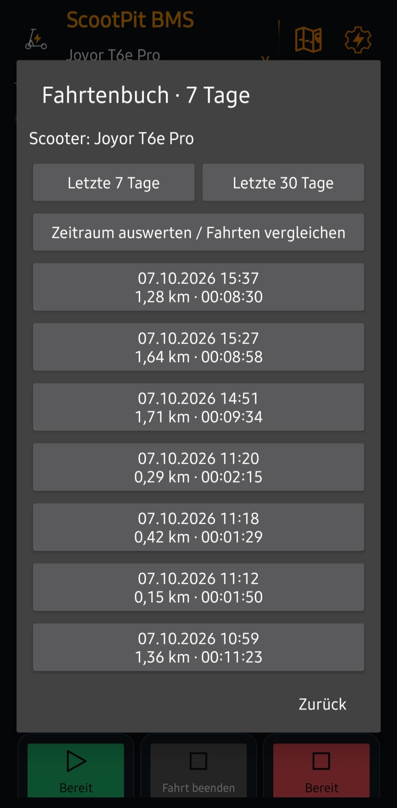
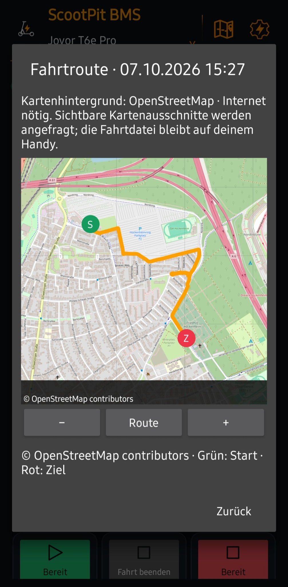
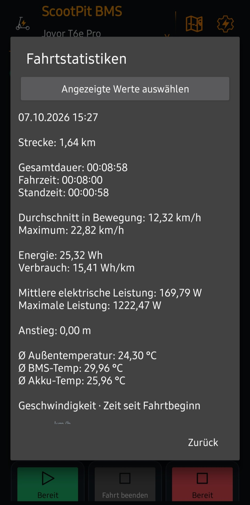

# Fahrtenbuch, Karte und Statistiken

[← Übersicht](../README.md)

## Fahrt auswählen

Im Cockpit **Fahrtenbuch** oder unter Einstellungen **Fahrtenbuch / Karte / Statistiken** öffnen. Zwischen **Letzte 7 Tage** und **Letzte 30 Tage** wählen. Die Liste enthält abgeschlossene, lokal gespeicherte Fahrten des aktiven Scooter-Profils mit Datum, Startzeit, Strecke und Dauer. Auf eine Fahrt tippen und **Statistiken**, **Karte** oder **GPX und CSV teilen** wählen.

Es gibt keine automatische Löschung nach 30 Tagen; die Anzeige begrenzt nur den Zeitraum. Bereits vorhandene lokale Aufzeichnungen werden anhand ihrer JSON-Zusammenfassung und CSV-Datei gelesen. Externe Sicherungen werden nicht automatisch zurückimportiert; nach einer Neuinstallation sind lokal entfernte Fahrten nicht allein durch Auswahl des Exportordners wiederhergestellt.

*Fahrtenbuch: Fahrten je Scooter auswählen, die letzten 7 oder 30 Tage anzeigen und Zeiträume vergleichen.*

## Karte

Start ist grün mit S, Ziel rot mit Z. Verschieben mit dem Finger, zoomen per Geste oder +/−, mit **Route** wieder die gesamte Strecke einpassen. Die Route wird auf dem Handy gezeichnet. Nur sichtbare OpenStreetMap-Hintergrundkacheln werden aus dem Internet geladen und zwischengespeichert. Bei fehlendem Internet bleibt die Route auf einem einfachen Hintergrund sichtbar; bereits vorhandene Kartenkacheln können aus dem Cache erscheinen. Es gibt keinen Download ganzer Offline-Gebiete.

OpenStreetMap erhält IP-Adresse und angefragte Kartenausschnitte, keine Fahrtdatei. [OpenStreetMap-Lizenz und Mitwirkende](https://www.openstreetmap.org/copyright), [Kachelnutzung](https://operations.osmfoundation.org/policies/tiles/).

*Kartenansicht einer aufgezeichneten Fahrt: Grün markiert den Start, Rot das Ziel. © OpenStreetMap contributors.*

## Statistiken auswählen

**Angezeigte Werte auswählen** öffnet Häkchen für Strecke, Fahr-/Standzeit, Geschwindigkeit, Energie/Verbrauch, elektrische Leistung, Höhenmeter, Temperaturen sowie die drei Diagramme. Auswahl wird pro Scooter gespeichert. Fehlende Daten werden als **Nicht aufgezeichnet** angezeigt.

Durchschnittsgeschwindigkeit bezieht sich auf die Fahrzeit in Bewegung. Verbrauch = Wh je gefahrenem Kilometer. Leistung ist elektrisch am BMS gemessen. Temperaturen sind gespeicherte Fahrtmittelwerte; Höhe und Anstieg bleiben GPS-Schätzungen. Bei alten Aufzeichnungen ohne gespeicherte Zeitaufteilung kann sie für die Einzelansicht aus vorhandenen CSV-Punkten angenähert werden.

Die Diagramme zeigen Geschwindigkeit, elektrische Leistung und GPS-Höhe über die Zeit seit Fahrtbeginn. Eine fehlende Messung wird nicht als erfundener Nullwert gezeichnet. Lange Aufzeichnungen werden für die Darstellung ausgedünnt.

*Fahrtstatistiken: Strecke, Zeit, Geschwindigkeit, Energie, Verbrauch und Temperaturen auswerten; angezeigte Werte selbst auswählen.*

## Zeitraum auswerten

**Zeitraum auswerten / Fahrten vergleichen** zeigt Anzahl, Summen und passende ausgewählte Kennwerte. Kilometer pro Tag werden mit Balken visualisiert. Einzelne Fahrten sind darunter mit Strecke, Dauer und – je nach Auswahl – Verbrauch und Höchstgeschwindigkeit vergleichbar. Anklicken öffnet wieder die Fahrtansicht. Statistiken funktionieren ohne Internet.
